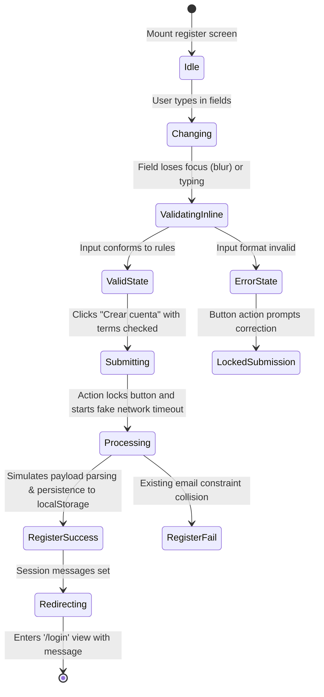

# Design Data Model: Registration State (KynWallet)

Following Clean Architecture, we separate the raw representation models from our validation logics and infrastructure.

## 1. Core Data Entities

### UserRegistrationData (Domain/Application Layer)
This represents the temporary structure maintained by our registration form state.

```typescript
export interface UserRegistrationData {
  FullName: string;
  Email: string;
  Password: string;
  ConfirmPassword: string;
  AgreedToTerms: boolean;
}
```

### User (Domain Layer)
The persistent domain object loaded inside `AuthService`. Since we do not use databases, registered records will map to this interface.

```typescript
export interface User {
  FullName?: string; // Optional field for extended user info
  Email: string;
  Password: string;
}
```

---

## 2. Validation Model

### RegistrationErrors (UI Representation Layer)
Maintains individual validation flags or messages mapping exactly to each input component.

```typescript
export interface RegistrationErrors {
  FullName?: string;
  Email?: string;
  Password?: string;
  ConfirmPassword?: string;
  AgreedToTerms?: string;
}
```

---

## 3. State Transitions and Flow


