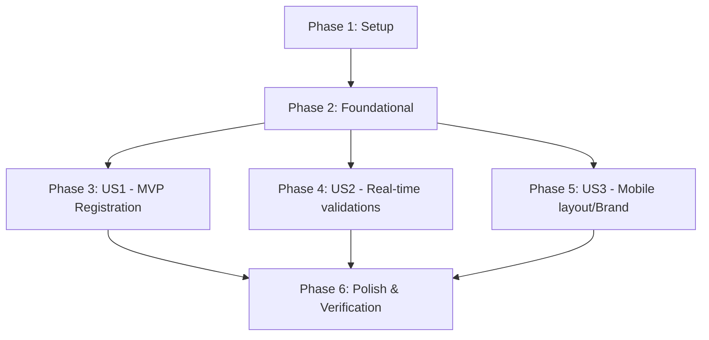

# Tasks: User Registration (KynWallet)

**Input**: Design documents from `/specs/002-user-registration/`
**Prerequisites**: [specs/002-user-registration/plan.md](specs/002-user-registration/plan.md) (required), [specs/002-user-registration/spec.md](specs/002-user-registration/spec.md) (required for user stories), [specs/002-user-registration/research.md](specs/002-user-registration/research.md), [specs/002-user-registration/data-model.md](specs/002-user-registration/data-model.md), [specs/002-user-registration/contracts/auth-service.md](specs/002-user-registration/contracts/auth-service.md)

**Tests**: TDD is Enforced by Phase. Prior unit, service, and layout interactive mock-tests are planned and executed as part of each story phase's validation lifecycle.

**Organization**: Tasks are grouped by user story to enable independent implementation and testing of each story, ensuring incremental value and solid architecture.

## Format: `[ID] [P?] [Story] Description`

- **[P]**: Can run in parallel (different files, no dependencies)
- **[Story]**: Which user story this task belongs to (e.g., US1, US2, US3)
- All descriptions include explicit file paths.

---

## Phase 1: Setup (Shared Infrastructure)

**Purpose**: Project and workspace directory arrangement

- [X] T001 Initialize routes and register directory placeholders in [app/registry/page.tsx](app/registry/page.tsx)
- [X] T002 [P] Clean dynamic types and export registry interface parameters in [lib/types/Auth.ts](lib/types/Auth.ts)

---

## Phase 2: Foundational (Blocking Prerequisites)

**Purpose**: Core validation utilities and backend mock state adapters that MUST be complete before ANY user story can be implemented

**⚠️ CRITICAL**: No user story layout work can begin until this phase is complete.

- [X] T003 Implement unit test framework validations for Name format in [lib/utils/Validation.test.ts](lib/utils/Validation.test.ts)
- [X] T004 Implement Name regex validator (`validateFullName`) with standard space limits in [lib/utils/Validation.ts](lib/utils/Validation.ts)
- [X] T005 [P] Implement complex security validator (`validateComplexPassword`) verifying lowercase/uppercase/numbers in [lib/utils/Validation.ts](lib/utils/Validation.ts)
- [X] T006 Implement mock adapter integration tests for dynamic registered user signups in [lib/services/AuthService.test.ts](lib/services/AuthService.test.ts)
- [X] T007 Implement the expanded dynamic memory persistence structure using browser `localStorage` lookup sequentially in [lib/services/AuthService.ts](lib/services/AuthService.ts)

**Checkpoint**: Foundation ready - user story implementation can now begin.

---

## Phase 3: User Story 1 - Registración Exitosa y Login Sincronizado (Priority: P1) 🎯 MVP

**Goal**: Full input processing, memory storage simulation and seamless redirection on registry success.

**Independent Test**: Registering a valid profile redirects successfully and enables standard login authorization dynamically through the updated `AuthService`.

### Tests for User Story 1 (TDD Enforced) ⚠️

- [X] T008 [P] [US1] Create form component render, input matching and successful mock submission tests in [components/RegisterForm.test.tsx](components/RegisterForm.test.tsx)
- [X] T009 [P] [US1] Add integration route navigation redirect mock test scenarios in [app/registry/page.test.tsx](app/registry/page.test.tsx)

### Implementation for User Story 1

- [X] T010 [P] [US1] Design presentational structure of the register container and layout wrapper in [app/registry/page.tsx](app/registry/page.tsx)
- [X] T011 [US1] Implement interactive input event state handlers, password complexity validation and terms validation triggers in [components/RegisterForm.tsx](components/RegisterForm.tsx)
- [X] T012 [US1] Implement submission logic of `register()` on `AuthService` coupled with double-click submit prevention spinner in [components/RegisterForm.tsx](components/RegisterForm.tsx)
- [X] T013 [US1] Add registration alert flashing mechanism on Next.js url state routing and update login interface message hooks in [components/LoginForm.tsx](components/LoginForm.tsx)

**Checkpoint**: At this point, User Story 1 (MVP) is fully functional and testable independently.

---

## Phase 4: User Story 2 - Validaciones en Tiempo Real e Icono de Visualización (Priority: P2)

**Goal**: Seamless real-time feedback with layout cues, toggle elements, and field formatting on blur.

**Independent Test**: Error labels immediately flash under matching inputs upon losing focus or input mismatch, and password eyes correctly toggle between password/text types.

### Tests for User Story 2 ⚠️

- [X] T014 [P] [US2] Implement real-time interaction states and Eye icon visibility toggle tests in [components/RegisterForm.test.tsx](components/RegisterForm.test.tsx)

### Implementation for User Story 2

- [X] T015 [US2] Create state indicators `showPassword` and `showConfirmPassword` tied to responsive inline SVG eyes in [components/RegisterForm.tsx](components/RegisterForm.tsx)
- [X] T016 [US2] Build automatic focus blur listeners (`onBlur`) for Name, Email, and Password error rendering in [components/RegisterForm.tsx](components/RegisterForm.tsx)
- [X] T017 [US2] Establish strict dynamic disabled states on the submit button based on form invalid flags in [components/RegisterForm.tsx](components/RegisterForm.tsx)

**Checkpoint**: Users receive instantaneous field-level visual warnings instantly, completing User Story 2.

---

## Phase 5: User Story 3 - Diseño Responsivo y Accesos de Marca (Priority: P3)

**Goal**: Mirroring high-fidelity Figma visual ratios, logo sizes, responsive collapse, and social buttons.

**Independent Test**: Brand panel hides completely on viewport sizes under `1024px`, and social buttons emit a temporary alert banner.

### Tests for User Story 3 ⚠️

- [X] T018 [P] [US3] Implement screen responsiveness mock-media style layout render tests in [components/RegisterForm.test.tsx](components/RegisterForm.test.tsx)

### Implementation for User Story 3

- [X] T019 [US3] Assemble responsive layout framework (`flex flex-col lg:flex-row`) rendering the branding panel in [app/registry/page.tsx](app/registry/page.tsx)
- [X] T020 [US3] Build social mock handlers for Google and Apple displaying a temporarily "Funcionalidad próximamente disponible" alert in [components/RegisterForm.tsx](components/RegisterForm.tsx)
- [X] T021 [P] [US3] Align design tokens, button colors (`#ff6b3d`), margin offsets, and border-radius `12px` according to Figma parameters in [components/RegisterForm.tsx](components/RegisterForm.tsx)

**Checkpoint**: Register screen adapts flawlessly from desktop down to mobile viewports.

---

## Phase 6: Polish & Cross-Cutting Concerns

**Purpose**: System sanity checks and test suite completions before delivery

- [X] T022 Clean up local user storage keys and optimize the testing suite suite setup in [vitest.setup.ts](vitest.setup.ts)
- [X] T023 Run E2E manual walkthrough instructions listed in [specs/002-user-registration/quickstart.md](specs/002-user-registration/quickstart.md)

---

## Dependencies & Execution Order

### Parallel Execution Strategy

Within the execution pipeline, developers can run several streams concurrently once Phase 2 (Foundational Validation & Service persistence logic) completes:

* **Stream A (Auth Flow Core)**: Real-time validation interactive fields & dynamic logic ([components/RegisterForm.tsx](components/RegisterForm.tsx)) -> T011, T012, T013.
* **Stream B (Testing & Spec gates)**: Writing unit tests for the interaction model (`T008`, `T009`, `T014`).
* **Stream C (CSS Design & Branding)**: Constructing responsivity styles, brand icons, and mobile-collapse layout behaviors in [app/registry/page.tsx](app/registry/page.tsx).

---

## Parallel Example: User Story 1

To fast-track implementation of User Story 1, tasks can be processed in parallel across developers:
* **Developer 1 (Validation Core)**: Focus on `T011` creating state interactions and input listeners.
* **Developer 2 (Layout & Routing)**: Focus on `T010` and `T013` building the routing container and setting route alert flags.
* **Developer 3 (Test Engineer)**: Focus on parallel test tasks `T008` and `T009` in RTL.
